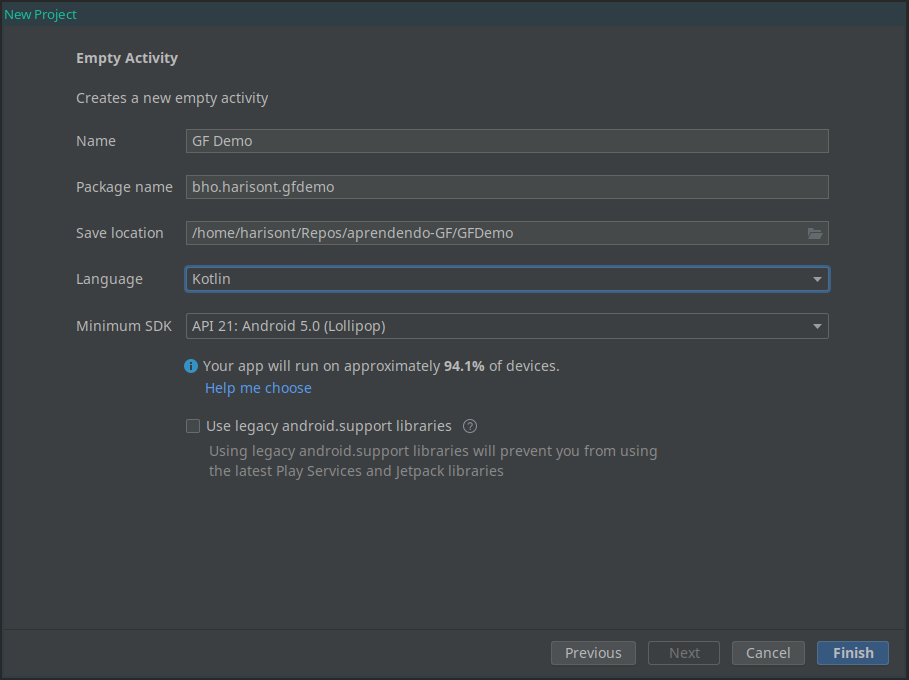
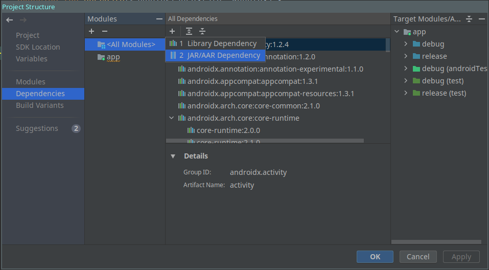
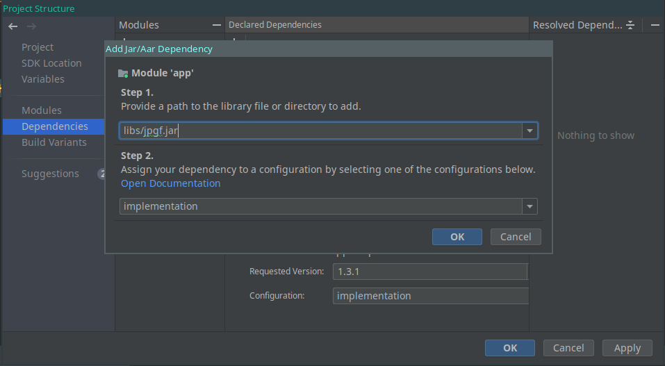
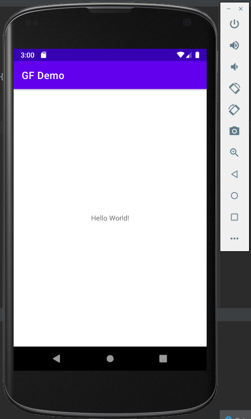

# Using GF grammars in Android applications: a step-by-step tutorial
Prerequisites:
- Java Development Kit
- GF C runtime
- the grammar you want to use in `.pgf` format
- Android Studio

## Step 1: Compile the Java bindings

> __NOTE:__ You might be able to skip this step if you have installed a GF binary.

Even if you have installed GF and its C runtime, you might have never needed to compile the Java bindings.
If this is the case, follow these steps:

1. __move to the Java bindings folder__:
    ```
    cd WHEREVER-YOU-CLONED-GF-CORE/gf-core/src/runtime/java
    ```
2. __try running `make`__. If this fails with an error such as
   ```
   Makefile:33: *** No JNI headers found.  Stop.
   ```
   that means that the `Makefile` was unable to locate your `jni.h` and `jni_md.h` files. What are they, you might well be wondering? Well, they are some `jdk` things we don't really need to understand. We just need to `locate` them:
   ```
   locate jni.h
   ```
   In my case, as I messed up with different versions of Java for different projects, this returns various locations:
   ```
   /home/harisont/.cache/yay/android-studio/src/android-studio/jre/include/jni.h
   /home/harisont/.jdks/corretto-1.8.0_292/include/jni.h
   /usr/include/libavcodec/jni.h
   /usr/lib/jvm/java-11-openjdk/include/jni.h
   /usr/lib/jvm/java-16-openjdk/include/jni.h
   ```
   and the results are similar if I try to `locate jni_md.h`:
   ```
    /home/harisont/.cache/yay/android-studio/src/android-studio/jre/include/linux/jni_md.h
    /home/harisont/.jdks/corretto-1.8.0_292/include/linux/jni_md.h
    /usr/lib/jvm/java-11-openjdk/include/linux/jni_md.h
    /usr/lib/jvm/java-16-openjdk/include/linux/jni_md.h
   ```
   Common sense suggests me that I should use the first path, as it seems to be the one of the JDK used by Android Studio. But this might as well make no difference.
   Once you have decided what path to try and use, modify the `Makefile`: replace whatever is assigned to `JNI_INCLUDES` with `-I FOLDER-CONTAINING-jni.h FOLDER-CONTAINING-jni_md.h`. In my case, this means
   ```
   JNI_INCLUDES = -I /home/harisont/.cache/yay/android-studio/src/android-studio/jre/include/ -I /home/harisont/.cache/yay/android-studio/src/android-studio/jre/include/linux
   ```
   > __NOTE:__ on Windows, the syntax varies slightly, but the `Makefile` offers some good examples
3. __run `make install`__. You should get something like
   ```
   ----------------------------------------------------------------------
   Libraries have been installed in:
      /usr/local/lib
   
   If you ever happen to want to link against installed libraries
   in a given directory, LIBDIR, you must either use libtool, and
   specify the full pathname of the library, or use the '-LLIBDIR'
   flag during linking and do at least one of the following:
      - add LIBDIR to the 'LD_LIBRARY_PATH' environment variable
        during execution
      - add LIBDIR to the 'LD_RUN_PATH' environment variable
        during linking
      - use the '-Wl,-rpath -Wl,LIBDIR' linker flag
      - have your system administrator add LIBDIR to '/etc/ld.so.   conf'
   
   See any operating system documentation about shared libraries    for
   more information, such as the ld(1) and ld.so(8) manual pages.
   ----------------------------------------------------------------------
   install jpgf.jar /usr/local/lib
   ```

## Step 2: Import `jpgf` in Android Studio
Alright, at this point you should have something called `jpgf` installed somewhere. In my case, that somewhere is `/usr/local/lib`, as shown in the message above. In fact, I can run

```
~ ls /usr/local/lib | grep jpgf                          
jpgf.jar
libjpgf.la
libjpgf.so
libjpgf.so.0
libjpgf.so.0.0.0
```

The `.jar` file is what we really care about. Time to put it to use in Android Studio!

1. open Android Studio and __create a new project__ (`File > New > New Project`). If you want to reproduce my simple demo app, select `Empty Activity`, then `Next`, and use this screenshot as a reference in the following screen:
   
   
   > __NOTE:__ I set `Language` to `Kotlin` as it is my preferred Android development language and any Java library can also be used as a Kotlin library. Isn't that magic?
   
   Then click on `Finish` and let Gradle do his thing.
2. __copy the `.jar` file to `/app/libs` subfolder of your Android Studio Project__. For instance:
   ```
   cp /usr/local/lib/jpgf.jar GFDemo/app/libs
   ```
3. __add the `.jar` to the project dependencies__: 
   - go to `File > Project Structure`
   - select the `Dependencies` tab
   - click on the `+` button (`Add dependencies`) and select `JAR/AAR dependency`:
     
   - provide the path to the jar file just added. Note that `app` is the default folder where dependencies are stored, so typing in `libs/jpgf.jar` should suffice:
     
   - click on `Ok` (twice) and let Gradle do his job again
4. __check that everything works__ by trying to build (or even run, if you have a physical Android device or emulator already set up).

## Step 3: Prepare a `.pgf` for your Android app
If you run the app as it is, you should hopefully see something like this:


For this tutorial, we have a simple goal: to replace that boring "Hello World!" that we see every time we launch the app with a randomly generated sentence using the `Hello` grammar (in my case, I'll use my own English-Portuguese version, but you can use any grammar).

The first step in this direction is to place a grammar in `.pgf` format in the correct folder of our Android Studio project.

1. Move to the folder your grammar is stored in and __compile it to `.pgf`__. In my case:
   ```
   ~ gf -make HelloEng.gf HelloPor.gf
   - compiling HelloEng.gf...   write file HelloEng.gfo
   linking ... OK
   Writing Hello.pgf...
   ```
2. in Android terms, we treat the resulting `.pgf` file as an asset. In your Android studio project, __create a directory named `assets` under `app/src`__. In my case, from the main project folder:
   ```
   mkdir app/src/main/assets
   ```
3. __copy the `.pgf` to `assets`__:
   ```
   cp ../Hello/Hello.pgf app/src/main/assets
   ```

## Step 4 (optional): getting to know the code of the automatically generated Android app
In the automatically generated Android Studio project app, the "Hello World!" text is set in the layout (`activity_main.xml`) file used in the main Activity:

```xml
<?xml version="1.0" encoding="utf-8"?>
<androidx.constraintlayout.widget.ConstraintLayout xmlns:android="http://schemas.android.com/apk/res/android"
    xmlns:app="http://schemas.android.com/apk/res-auto"
    xmlns:tools="http://schemas.android.com/tools"
    android:layout_width="match_parent"
    android:layout_height="match_parent"
    tools:context=".MainActivity">

    <TextView
        android:layout_width="wrap_content"
        android:layout_height="wrap_content"
        android:text="Hello World!" -- LOOK HERE
        app:layout_constraintBottom_toBottomOf="parent"
        app:layout_constraintLeft_toLeftOf="parent"
        app:layout_constraintRight_toRightOf="parent"
        app:layout_constraintTop_toTopOf="parent" />

</androidx.constraintlayout.widget.ConstraintLayout>
```

Of course, we can change it programatically. Android development can be confusing, so let's first do it without using GF:

1. In the `.xml` file, __add an `id` to the `TextView`__. This means adding the following line anywhere inside the `TextView` tag:
   ```xml
   android:id="@+id/sentence"
   ```
2. __go to the `MainActivity` class of the `MainActivity` module__. If you are using Kotlin, it should look something like this:
   ```kotlin
   class MainActivity : AppCompatActivity() {
      override fun onCreate(savedInstanceState: Bundle?) {
         super.onCreate(savedInstanceState)
         setContentView(R.layout.activity_main)
      }
   }
   ```
3. after the call to `setContentView`, the function setting the Activity's layout, add the following line, which modifies the `TextField`'s text:
   ```
   sentence.text = "Hello Everyone!"
   ```

   > __NOTE:__ yes, no stupid calls to `findViewById` or anything like that. That's why we use Kotlin after all! If this doesn't work, that's because for some weird reason your Kotlin extensions are not enabled by default. No worries, [enabling them is easy enough](https://stackoverflow.com/questions/64431882/how-to-enable-kotlin-android-extensions-by-default-in-android-studio-4-1). If you do that, you might need to add the following `import` statement to your `MainActivity.kt:
     ```kotlin
     import kotlinx.android.synthetic.main.activity_main.*
     ```

If you relaunch the app, it will display "Hello Everyone!" instead of "Hello World!". Now it's time to get our greetings from GF!

## Step 5: Finally using the grammar in your Android app!
