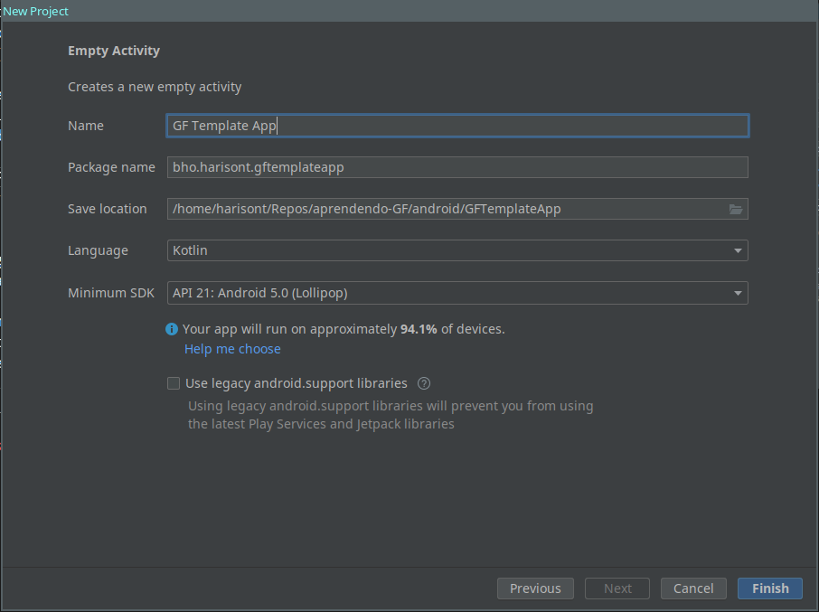

# Using GF grammars in Android applications: a step-by-step tutorial
This guide explains how to reproduce the template app contained in this repository. Unless you need an understanding of what's going on or you encountered some issues with the template app itself, you can simply fork this repository and start working on the code.
## Requirements
- the [Android Studio](https://developer.android.com/studio/) IDE (yes, you can use other IDEs too but don't ask me exactly how)
- the Android SDK (API libraries and tools necessary to build, test, and debug Andorid apps. Usually comes with Android Studio but who knows, there's countless ways to install it)
- an Android device with USB debugging enabled and/or an emulator (you can set it up from Android Studio)
- [GF](https://www.grammaticalframework.org/download/index-3.11.html) 
- a GF grammar ready to use in your application
- plenty of patience.

## Step 1: Create an Android Studio project
1. launch Android Studio 
2. click (`File > New > New Project`). 
3. select `Empty Activity`, then `Next`
4. for the following screen, you can use this screenshot as a reference:
   
   
   > __NOTE:__ I set `Language` to `Kotlin` as it is my preferred Android development language and any Java library can also be used as a Kotlin library. Isn't that magic?
   
5. click on `Finish` and let Gradle do his thing. It will take a while.

## Step 2: Download or build the GF Java bindings as JAR file
If you want to get started quickly, just download [this JAR file](prebuilt/jpgf.jar).

If you are someone who has a little bit of time to spare, or who has good reasons to think the Java bindings have changed, you can of course build it yourself:

1. if you installed GF from a binary package, clone [gf-core](https://github.com/GrammaticalFramework/gf-core)
2. from the gf-core folder, move to the Java bindings folder
   ```
   cd src/runtime/java/
   ```
3. compile the Java bindings: 
   ```
   javac org/grammaticalframework/*/*.java
   ```
4. build the jar
   ```
   jar -cf jpgf.jar org/grammaticalframework/pgf/*.class
   ```
   at this point you should have a file named `jpgf.jar` in the current folder.

## Step 3: Provide Android Studio with the necessary `.jar` and `.so` files
1. copy `jpgf.jar` to your Android Studio project's `app/libs` folder
2. in Android Studio, right click on `jpgf.jar` (for your own sanity, switch to Project view, otherwise you'll see a different directory structure) and select `Add As Library...` and click `Ok` in the dialog that will pop up
3. copy [the three folders under `/prebuilt`](prebuilt) to your Android Studio project's `app/src/main/jniLibs` (if it does not exist, create it). They contain the `.so` files for different smartphone and tablet architectures
   > __NOTE:__ If you're wondering why you _have to_ download these prebuilt files, the reason is that I don't really know how to build them. In case you want to find a way, here are some hints: 
   >
   > - you will need the [Android NDK](https://developer.android.com/ndk/)
   > - you probably want to check the now archived monolithic [GF repository](https://github.com/GrammaticalFramework/GF), and [this folder](https://github.com/GrammaticalFramework/GF/tree/master/src/ui/android/jni) in particular.
   >
   > If you find a solution, be sure to open a PR!

## Step 4: Provide Android studio with the actual grammar
1. move to the folder where your GF grammar is stored. In this template app, we use the `Hello` grammar under `grammars`
2. compile it to PGF with `gf -make`
3. create a directory named `assets` under your Android Studio project's `app/src/main`
4. __copy the PGF to `assets`

## Step 5 (optional): getting to know the code of the automatically generated Android app
If you run the Android app generated by Android Studio as it is, you should see something like this:
.

The "Hello World!" text you see in the screenshot is set in the layout (`activity_main.xml`) file used in the main Activity:

```xml
<?xml version="1.0" encoding="utf-8"?>
<androidx.constraintlayout.widget.ConstraintLayout xmlns:android="http://schemas.android.com/apk/res/android"
    xmlns:app="http://schemas.android.com/apk/res-auto"
    xmlns:tools="http://schemas.android.com/tools"
    android:layout_width="match_parent"
    android:layout_height="match_parent"
    tools:context=".MainActivity">

    <TextView
        ...
        android:text="Hello World!"
        .../>

</androidx.constraintlayout.widget.ConstraintLayout>
```

Of course, we can change it programatically, from Kotlin or Java code. Android development can be confusing, so let's first do it _without_ using our GF grammar:

1. in the `.xml` file, __add an `id` to the `TextView`__. This means adding the following line anywhere inside the `TextView` tag:
   ```xml
   android:id="@+id/greeting"
   ```
2. __go to the `MainActivity` class of the `MainActivity` module__. If you are using Kotlin, it should look something like this:
   ```kotlin
   class MainActivity : AppCompatActivity() {
      override fun onCreate(savedInstanceState: Bundle?) {
         super.onCreate(savedInstanceState)
         setContentView(R.layout.activity_main)
      }
   }
   ```
3. after the call to `setContentView`, the function setting the Activity's layout, add the following line, which modifies the `TextField`'s text:
   ```
   greeting.text = "Hello Everyone!"
   ```

   > __NOTE:__ yes, no stupid calls to `findViewById` or anything like that. That's why we use Kotlin after all! If this doesn't work, that's because for some weird reason your Kotlin extensions are not enabled by default. No worries, [enabling them is easy enough](https://stackoverflow.com/questions/64431882/how-to-enable-kotlin-android-extensions-by-default-in-android-studio-4-1). If you do that, you might need to add the following `import` statement to your `MainActivity.kt:
     ```kotlin
     import kotlinx.android.synthetic.main.activity_main.*
     ```

If you relaunch the app, it will display "Hello Everyone!" instead of "Hello World!". Now it's time to get our greetings from GF!

## Step 6 (optional): Random greetings with GF!
It's finally time to use GF from Android:

1. in `MainActivity.kt` (or `MainActivity.java` if you're using Java), add the following import statement:
   ```kotlin
   import org.grammaticalframework.pgf.*
   ```
2. 

---


For this tutorial, we have a simple goal: to replace that boring "Hello World!" that we see every time we launch the app with a randomly generated sentence using the `Hello` grammar (in my case, I'll use my own English-Portuguese version, but you can use any grammar).

> __NOTE:__ I will just show you how to make GF work in an Android app at its most basic level. For a more in-depth tutorial about the Java bindings, follow [this link](https://www.grammaticalframework.org/doc/runtime-api.html#java).

